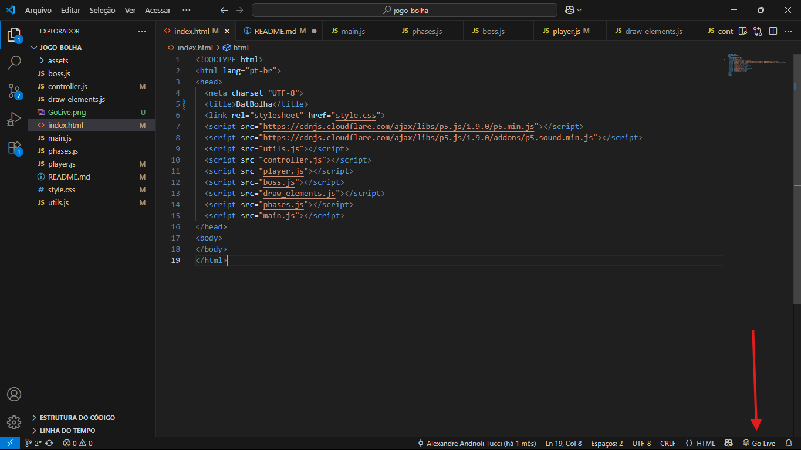

Alunos: Matheus De Bortoli Silva, Roberto Zhou, Alexandre Andrioli Tucci, João Victor Saboya Ribeiro de Carvalho

Como executar:
Para executar o jogo no VS Code, é necessário instalar e habilitar a extensão "Live Server" de Ritwick Dey. Após isso, abra o arquivo index.html (localizado na pasta jogo-bolha, junto com os arquivos .js e a pasta assets) e clique no ícone "Go Live" no canto inferior direito da tela (veja a imagem ilustrativa: ). Isso abrirá o jogo em uma janela de um navegador.

Como Jogar:
BatBolha é um jogo de plataforma onde você controla o BatBolha com o objetivo de derrotar o Camarão Pistola através das fases! Controles:
A: mover para a esquerda;
D: mover para a direita;
W ou Espaço: pular;
S: descer;
Botão direiro do Mouse: atirar bolhas;

Colete corações para recuperar vidas e desvie dos ataques do Boss!

Link do YouTube:
    